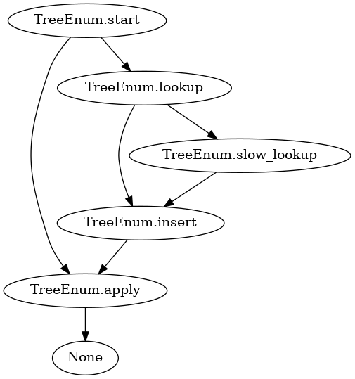

# pipetree

Toy type-aware cascading process streamer for python. The intended use is for smallish task graphs that are IO bound and can run in a single process.

This provides 'structured concurrency', which means:
- your fast items stream quickly to the end
- your slow items finish at their own pace
- different fast and slow cases can run in parallel
- output order isn't guaranteed

(Warning: don't try to install this from pypi -- there is another package with this name).

This graphviz dotfile is generated automatically from code:



If you specify a cascading process like this:

```python
import enum
from pipetree.pipetree import PipeTree

class TreeEnum(enum.Enum):
    start = 0
    cached = 1
    lookup = 2
    slow_lookup = 3
    insert = 4
    apply = 5

pt = PipeTree(
    state_enum=TreeEnum,
    calls={
	# I know these are hard to look at, basically they return (enum, item) in varying ratios
        TreeEnum.start: lambda x: (TreeEnum.apply, x) if x % 4 == 0 else (TreeEnum.lookup, x),
        TreeEnum.lookup: lambda x: (TreeEnum.insert, x) if x % 3 == 0 else (TreeEnum.slow_lookup, x),
        TreeEnum.slow_lookup: lambda x: (TreeEnum.insert, x),
        TreeEnum.insert: lambda x: (TreeEnum.apply, x),
        TreeEnum.apply: lambda x: None,
    }
)
```

PipeTree will do the following for you:
- infer the returned enums to build a graph
- check that this is a DAG (i.e. no dangerous cycles)
- run this in-process using asyncio.Queue to glue parallel tasks together
- generate a nice graph (see above)
- for a given run, produce counts for each edge in the graph

If you want to run cascading processes like this in a high-stakes prod context though, you should probably look at rxpy.
